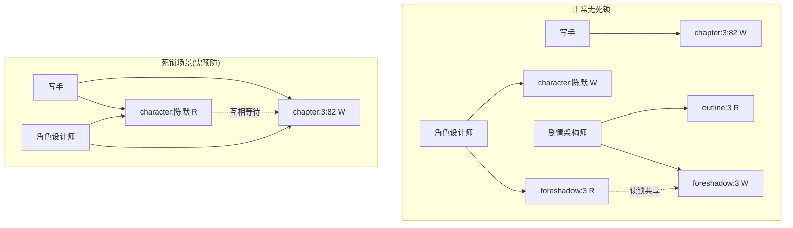

# 写锁机制 — 多Agent并发冲突防护

> ⚠️ 本机制是灵境系统的程序化保障层。所有涉及文件写入的多Agent并发操作，必须遵守写锁规则。
> 当前写作流程是文档驱动式，缺少程序化保障——本文件补全这一缺口。

## 一、问题域

### 现状风险

| 风险场景 | 当前表现 | 后果 |
|:---------|:---------|:-----|
| 多Agent并行写入同一文件 | 写手写章节、角色设计师写角色档案、剧情架构师写伏笔追踪，三者无协调 | 内容覆盖、部分更新丢失、文件中间态被读取 |
| 审查官与写入Agent时序竞争 | 审查官读取文件时写手正在写入 | 读到不完整内容导致误判打回 |
| Hook链式触发无锁 | `post-write` 触发时可能 `pre-write` 的产物尚未落盘 | Hook执行在脏数据上 |
| 跨章引用不一致 | 角色设计师查角色档案时写手正在更新同档案 | 角色指南基于过期状态 |

### 根因分析

灵境核心流程（`chapter-creation.md`）第2步是**并行派出**写手/角色设计师/剧情架构师三个Agent：

```
├── 写手智能体          ← 写入：章节文件
├── 角色设计师智能体     ← 写入：角色档案/角色状态变更清单
└── 剧情架构师智能体     ← 写入：伏笔追踪更新建议/剧情结构指南
```

三者之间没有程序化协调机制——当前依赖「负责人派发后各Agent自觉不冲突」，这在文档驱动时代可行，但随着Agent数量增长（33+ Agents），必须引入写锁。

## 二、锁模型设计

### 2.1 资源标识（Lockable Resources）

每个可锁定资源用 `resource_id` 唯一标识：

| 资源类型 | resource_id 格式 | 示例 | 粒度 |
|:---------|:-----------------|:-----|:-----|
| 章节文件 | `chapter:{volume}:{chapter_num}` | `chapter:3:82` | 单章 |
| 角色档案 | `character:{name}` | `character:陈默` | 单个角色 |
| 剧情大纲 | `outline:{volume}` | `outline:3` | 整卷 |
| 伏笔追踪 | `foreshadow:{volume}` | `foreshadow:3` | 整卷 |
| 设定集 | `setting:{topic}` | `setting:系统` | 单个设定条目 |
| 记忆库 | `memory:{context_id}` | `memory:session-042` | 单次记忆上下文 |

### 2.2 锁类型

| 锁类型 | 符号 | 语义 | 并发读 | 并发写 | 适用场景 |
|:-------|:-----|:------|:------:|:------:|:---------|
| **读锁 (R)** | 🔓 | 读取但不修改。多个Agent可同时持有 | ✅ | ❌ | 审查官查文件、角色设计师读大纲、知识检索 |
| **写锁 (W)** | 🔒 | 独占写入，阻塞所有其他读写 | ❌ | ❌ | 写手写章节、角色档案更新、伏笔更新 |
| **意向锁 (I)** | 🔐 | 声明即将请求写锁，防止死锁 | ✅ | ❌ | 第2步开始前声明资源使用意向 |

### 2.3 锁兼容矩阵

```
        R    W    I
   R    ✅   ❌   ✅
   W    ❌   ❌   ❌
   I    ✅   ❌   ✅
```

- **R-R兼容**：多个读者可以同时读
- **R-W互斥**：写时必须独占，读时必须一致快照
- **I-I兼容**：多个意向声明不互斥
- **I升级W时**：必须等待所有R释放（意向锁不阻塞他人声明意向，但升级时阻塞）

## 三、锁生命周期

### 3.1 状态机

```
             请求锁
               │
          ┌────▼────┐
    ❌    │  WAITING │ ← 锁已被持有，进入等待队列
          └────┬────┘
               │ 锁可用
          ┌────▼────┐
          │  ACQUIRED│ ← 锁已获取，可以操作资源
          └────┬────┘
               │ 操作完成
          ┌────▼────┐
          │ RELEASED │ ← 锁释放，唤醒等待队列中的下一个
          └─────────┘
```

### 3.2 等待策略

| 策略 | 行为 | 适用场景 | 最大等待时间 |
|:-----|:-----|:---------|:-------------|
| **阻塞等待** | 轮询直到锁可用 | 写手等待章节文件锁 | 120s |
| **超时放弃** | 等待N秒后放弃，报负责人仲裁 | 审查官等待角色档案锁 | 30s |
| **优先级抢占** | 高优先级任务可插队（需负责人授权） | 紧急修复/人工指定高优 | — |

- 默认策略：阻塞等待（写锁）/ 超时放弃（读锁，30s超时）
- 超时后：写入 `knowledge/errors/entries/` 一条死锁记录，通知负责人

### 3.3 锁管理器

锁管理器是一个轻量级进程内服务（或Hermes Agent子进程），提供以下接口：

```
lock(resource_id, type, holder_id, timeout=30) → bool | error
unlock(resource_id, holder_id) → bool
try_lock(resource_id, type, holder_id) → bool    # 非阻塞尝试
is_locked(resource_id) → {locked: bool, holder: str, type: str}
list_locks(holder_id) → [{resource_id, type, acquired_at}]
```

**实现载体建议：**

| 选项 | 适用阶段 | 说明 |
|:-----|:---------|:-----|
| 文件锁（`/tmp/writer-locks/`） | ✅ 当前即可落地 | 每个资源一个文件，内容为 JSON {holder, type, acquired_at}。无依赖，零启动成本 |
| Hermes Plugin | 中期升级 | 注册为 Hermes Agent 插件，提供 `hermes lock` 子命令 |
| 专用锁服务 | 未来（Agent规模>50） | 独立进程 + SQLite/Redis 后端 + 心跳超时释放 |

**文件锁协议（当前推荐实现）：**

```
# 锁目录
/tmp/writer-locks/{resource_id}.lock

# 锁文件内容格式（JSON）
{
  "holder": "writer-003",
  "type": "W",
  "acquired_at": "2026-07-19T10:30:00Z",
  "expires_at": "2026-07-19T10:32:00Z",
  "reason": "写第3卷第82章正文",
  "pid": 12345
}

# 加锁操作（原子性通过 mkdir 实现）
mkdir /tmp/writer-locks/{resource_id}.lock   # 成功=获取锁，失败=锁已存在
echo '{...}' > /tmp/writer-locks/{resource_id}.lock/lock.json

# 解锁操作
rm -rf /tmp/writer-locks/{resource_id}.lock

# 超时检测
# 锁文件的 expires_at 字段标记过期时间
# 任何Agent发现过期锁都可清理（stale-lock-reaper）
```

> **文件锁的mkdir原子性**：在POSIX文件系统上，`mkdir` 是原子操作——要么成功创建目录（获取锁），要么失败（目录已存在=锁已被持有）。无需额外加锁原语。Windows Git-Bash 环境下同样支持此语义。

### 3.4 锁超时与Stale锁回收

| 机制 | 触发条件 | 行为 |
|:-----|:---------|:-----|
| 主动释放 | 正常写入完成 | 立即释放所有持有的锁 |
| 超时自动释放 | 超过 `expires_at` | 锁管理器在下次检查时释放 |
| Stale锁回收 | 持有者进程已退出（PID不存在） | 任何Agent可安全清理 |
| 心跳续期 | 长操作主动更新 `expires_at` | 每30s续期一次（防误超时） |

## 四、流程集成

### 4.1 写入当前创作流程（chapter-creation.md）

在现有流程的每一步插入锁操作：

```
第1步：负责人派发前
  ├── 🔐 意向锁：声明本批任务将使用哪些资源
  │    ├── writer → I-lock(chapter:3:82)
  │    ├── character-designer → I-lock(character:陈默), I-lock(character:莉莉丝)
  │    └── plot-architect → I-lock(outline:3), I-lock(foreshadow:3)
  └── 如意向声明失败（资源已被其他写锁独占）→ 必须等待30s后重试

第2步：写作部门准备 + 同步创作
  │
  ├── 写手获取锁
  │   ├── ❌ 尝试 R-lock(foreshadow:3) — 读伏笔追踪（读锁，多Agent可共享）
  │   ├── ❌ 尝试 W-lock(chapter:3:82) — 写章节（写锁独占）
  │   ├── 获取失败 → 阻塞等待（默认120s）/ 超时报负责人
  │   └── 获取成功 → 开始写作
  │
  ├── 角色设计师获取锁
  │   ├── ❌ 尝试 R-lock(chapter:3:81) — 读前一章（读锁）
  │   ├── ❌ 尝试 W-lock(character:陈默) — 写角色状态（写锁）
  │   └── 与写手互斥资源：无（写手写章节，角色设计师写角色——不同资源）
  │
  ├── 剧情架构师获取锁
  │   ├── ❌ 尝试 R-lock(outline:3) — 读大纲（读锁）
  │   ├── ❌ 尝试 W-lock(foreshadow:3) — 更新伏笔（写锁）
  │   └── 冲突场景：与写手同时写 foreshadow:3（写锁互斥）
  │       → 按优先级：写手 > 剧情架构师 → 剧情架构师阻塞等待
  │
  └── 全部完成后释放所有锁
      ├── 写手释放 W-lock(chapter:3:82)
      ├── 角色设计师释放 W-lock(character:陈默)
      ├── 剧情架构师释放 W-lock(foreshadow:3)
      └── 负责人解锁意向锁

第3步：审查官审查
  ├── 🔓 R-lock(chapter:3:82) — 读最新章节（读锁，此时无写锁冲突）
  ├── 🔓 R-lock(character:陈默) — 读角色档案
  ├── 🔓 R-lock(foreshadow:3) — 读伏笔追踪
  └── 审查完成后释放所有读锁

第4步：负责人执行更新
  ├── W-lock 更新角色档案（如需要）
  ├── W-lock 更新伏笔追踪
  └── 完成后退还所有锁
```

### 4.2 写锁与现有流程文件的引用关系

| 文件 | 引用方式 |
|:-----|:---------|
| `chapter-creation.md` | 在第1步、第2步、第3步插入锁操作（见4.1节） |
| `chapter-modify.md` | 修改流程第1-3步增加锁获取 |
| `writing/*-agent.md` | 各Agent文档声明其锁需求 |
| `hooks/pre-write.md` | Hook触发时验证所需锁是否已获取 |

## 五、死锁预防与检测

### 5.1 死锁条件

死锁发生的四个必要条件：

1. **互斥**：写锁一次只能一个Agent持有 ✅ 本设计满足
2. **持有并等待**：Agent持有锁的同时等待其他锁 ✅ 本设计允许
3. **不可抢占**：不能强制夺取其他Agent的锁 ✅ 本设计不允许（除超时外）
4. **循环等待**：A等B，B等C，C等A ❌ 本设计必须防止

### 5.2 预防策略

| 策略 | 做法 | 效果 |
|:-----|:-----|:------|
| **锁顺序** | 所有Agent按固定顺序请求锁：设定 > 角色 > 大纲 > 章节 > 记忆 | ✅ 消除循环等待 |
| **意向锁** | 先声明所有需要的资源再开始工作 | ✅ 提前暴露冲突 |
| **统一超时** | 所有写锁120s最大持有时间 | ✅ 防止无限持有 |
| **单次获取** | 一次获取所有需要的锁（all-or-nothing），不逐个获取 | ✅ 防止持有并等待 |

**推荐策略组合**：**锁顺序 + 意向锁**（最低侵入性，无需修改现有Agent代码）

### 5.3 死锁检测（兜底）

当写锁等待超过120s，或检测到循环等待图时：

```
① 检测到死锁 → 记录到 knowledge/errors/entries/
② 选择一个牺牲者（优先级最低的Agent）→ 强制释放其所有锁
③ 牺牲者回滚到检查点后重试
④ 通知负责人
```

### 5.4 死锁图谱可视化



## 六、Agent锁权限矩阵

不是每个Agent都能对所有资源加所有类型的锁。按最小权限原则：

| Agent | 可锁定资源 | 允许的锁类型 | 说明 |
|:------|:-----------|:-------------|:-----|
| 写手 | `chapter:*` | R, W | 章节是写手核心产出 |
| 写手 | `character:*` | R | 写章节前读角色状态，不写角色档案 |
| 写手 | `foreshadow:*`, `outline:*` | R | 参考用，不修改 |
| 角色设计师 | `character:*` | R, W | 角色档案更新者 |
| 角色设计师 | `chapter:*` | R | 读已有章节做参考 |
| 剧情架构师 | `foreshadow:*`, `outline:*` | R, W | 伏笔和大纲的维护者 |
| 剧情架构师 | `chapter:*`, `character:*` | R | 参考用 |
| 审查官 | `chapter:*` | **仅R** | 审查不修改章节文件本身 |
| 审查官 | `character:*`, `foreshadow:*`, `outline:*` | **仅R** | 审查只读，不写 |
| 审查官 | `setting:*` | **仅R** | 设定一致性检查只读 |
| 负责人 | `*` | R, W | 管理员权限，所有资源可读写 |
| 知识检索 | `*` | **仅R** | 检索不修改任何资源 |
| 润色师 | `chapter:*` | R, W | 去AI化修改章节正文 |
| 设定质检员 | `setting:*`, `character:*` | **仅R** | 只读检查 |

> 权限声明应写入各Agent的 `*-agent.md` 文档的 frontmatter 中，格式：
> `lock-permissions: [{resource: "chapter:*", type: ["R", "W"]}, ...]`

## 七、与现有机制的交互

### 7.1 与 guard-runtime-write Hook 的关系

`guard-runtime-write` hook 保护设定集/大纲/角色档案不被误改。写锁机制是它的补充层：

| 层次 | 防护机制 | 做用时机 | 防护对象 |
|:-----|:---------|:---------|:---------|
| L1 | guard-runtime-write hook | 写入前检查 | 受保护文件（白名单） |
| L2 | 写锁机制 | 写入时独占 | 所有锁定资源（按需） |
| L3 | pre-commit-check.sh | 写入后验证 | 文件一致性/完整性 |

两者不冲突：guard hook 做**策略检查**（能不能写这个文件），写锁做**互斥保障**（现在能不能写这个文件）。

### 7.2 与 adversarial-review Hook 的关系

对抗审查需要第二个审查Agent读取同一份文件。读锁兼容（R-R共享），无需额外协调。

### 7.3 与 pre-commit-check.sh 的关系

pre-commit-check 的自检项应增加：

| # | 检查项 | 说明 |
|:-:|:-------|:------|
| 10 | 写锁残留检测 | 检查 `/tmp/writer-locks/` 是否有超过2小时的残留锁文件 → 清理并记录 |

## 八、实现路线图

| 阶段 | 内容 | 依赖 |
|:-----|:------|:-----|
| **P0（当前可落地）** | 文件锁协议 + 流程文档更新 | `mkdir` 原子性（POSIX/Windows Git-Bash均支持） |
| **P1（近期）** | 锁管理器脚本 `lock_manager.sh/bat` | shell脚本基础 |
| **P2（中期）** | Agent文档增加 `lock-permissions` frontmatter 字段 | 系统自检脚本升级 |
| **P3（远期）** | Hermes Plugin 实现 `hermes lock` 命令 | Hermes Plugin SDK |

## 九、异常处理

| 异常 | 检测方式 | 处理流程 |
|:-----|:---------|:---------|
| 锁文件残留（进程崩溃） | 锁超时检测 / pre-commit-check #10 | stale-lock-reaper 自动清理 |
| 死锁 | 等待超时120s | 最低优先级Agent释放锁 → 重试 |
| 权限越界 | Agent请求了其权限表外的锁 | 拒绝请求 + 记录到错误知识库 |
| 锁文件损坏 | 解析JSON失败 | 视为stale锁清理 + 记录错误 |
| 同一Agent重复加锁 | 检测holder_id | 忽略重复请求（幂等） |

---

> **关联文件：**
> - `company/process/chapter-creation.md` — 创作流程主文档（锁集成点）
> - `company/process/chapter-modify.md` — 修改流程（锁集成点）
> - `company/writing/hooks/guard-runtime-write.md` — 写前守卫hook
> - `knowledge/errors/README.md` — 错误知识库
