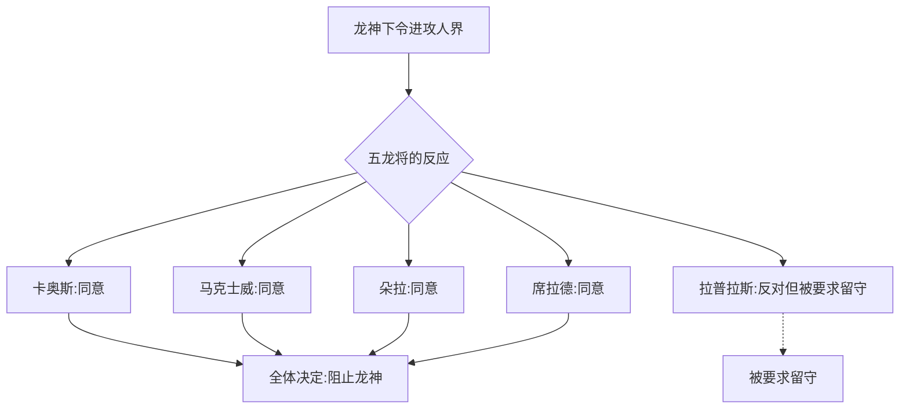

# 古龙昔话·第二十话 离反 + 第二十一话 五龙将的背叛·9维度分析

> **本能ID**: mushoku:gaiden-koryu-20-rebellion, mushoku:gaiden-koryu-21-dragon-generals-betray

---

## 1. 🌱 成长轨迹 —— 五龙将的抗命

### 龙神宣布进攻人界

拉普拉斯向龙神报告了涅克罗斯拉克罗斯的话后，龙神立刻说：
> "进攻人界"

原因：龙神意识到黑幕就藏在人界。

**但五龙将不理解**。
- 人族一直是盟友
- 人神一直在帮助他们
- 龙神已经满身是伤——再战可能会死

### 席拉德的"逻辑"

席拉德认为：
> "你肯定是被骗了"
> "涅克罗斯拉克罗斯为了保护自己，顺便挑起龙族和人族的争斗，所以才会说那些话"

**这是人神通过席拉德操控五龙将的关键一步**——席拉德作为最高位龙将的话堵住了其他质疑。

### 五龙将的决定

**最讽刺的地方**：五龙将阻止龙神攻打人界的理由是"保护龙神"——而他们其实是在帮助人神完成计划。

---

## 2. 💞 关系塑造 —— 最后的告别

### 拉普拉斯被排除

五龙将让拉普拉斯留在后方——照顾龙神的孩子（奥尔施泰德）。这也意味着：
- 他不参与"背叛"
- 他可以在战后收拾残局
- 他必须见证一切

### 龙神的最后信赖

龙神把最重要的任务交给了拉普拉斯：
> "为了以防万一，你去负责我儿子的护卫工作"
> "不许让任何人伤到他"

龙神信任拉普拉斯胜过其他五龙将——因为他知道拉普拉斯不会背叛。

---

## 3. 🏰 世界构建 —— 五龙将的战争准备

### 混沌破坏者(Chaos Breaker)

五龙将准备了一座巨型空中要塞来对抗龙神：
- 利用天界常见的浮游岩石
- 埋入高魔力核心
- 用龙鳞覆盖外部
- 设置魔族的魔术砲塔
- **完全城塞化**

### 身体化龙秘术

魔族开发的技术被龙族改良：
- 把自己的身体变成接近原始龙的状态
- 鳞片变厚、长出角、身体增大三倍
- 获得爆发性力量
- 代价：寿命大幅减少

### 龙神的刀

卡奥斯锻造的神刀——"龙神刀"——能承受龙神力量的真正神之武器。

---

## 4. 📖 剧情结构 —— 最终战的展开

### 第一阶段：凯欧斯毁灭

马克士威的龙门炮远程炮击 → 龙鸣山（凯欧斯城）被一炮消灭。

### 第二阶段：要塞逼近

Chaos Breaker 接近龙神 → 44个精灵使用歪曲力场防御龙神的远程攻击。

### 第三阶段：刀斩要塞

龙神拔刀 → 刀光仿佛"连世界都被斩开" → 要塞被一分为二。

### 第四阶段：四龙将化龙

四龙将化龙肉身，使用神枪，围攻龙神。

### 第五阶段：六天六夜的战斗

- 龙神重伤但依然压倒性强大
- 四龙将拼尽全力"只是能触及神"的程度
- 第七天：分出胜负 → 四龙将全数濒死

### 第六阶段：人神的偷袭（全书最关键转折）

就在龙神击败四龙将后——一只手穿透了龙神的胸膛。

**是人神。**

他一直在暗处等待，在龙神和最信赖的下属两败俱伤后，给予了致命一击。

---

## 5. ⚔️ 战斗设计 —— 龙神 vs 四龙将

### 战力的不对等

龙神的状态：
- 之前与其他神战斗的伤还没好（肩膀、眼睛、腿）
- 筋疲力尽
- 但依然是神

四龙将的状态：
- 经过化龙秘术强化
- 装备神枪
- 有44个精灵辅助
- 准备充分 → **但只有万分之一的胜率**

### 龙神的压倒性力量

- 一记拔刀斩把整座要塞切成两半
- 四龙将的围攻只能"触及神的指尖"
- 即使濒死，龙神的攻击仍然致命

---

## 6. 🔮 权力格局 —— 人神的完全胜利

### 人神的真正目的

> "让神与神争斗，毁灭世界"

这就是人神的全部计划：
1. 暗杀露娜莉亚，嫁祸给其他世界
2. 利用被煽动的龙神毁灭其他世界
3. 让五龙将和龙神自相残杀
4. 在龙神最虚弱时给予致命一击

### 席拉德的悔恨

当人神揭露真相时，席拉德才意识到自己是人神的棋子：
- 他提议开战（被暗示）
- 他提议阻止龙神（被暗示）
- 他做的所有"正确决定"都是人神设计好的

**他的赎罪**：切断双腿、打掉牙齿、挖出眼睛、捏碎自己的心脏自杀。

---

## 7. 💭 主题深度

### 忠义的悲剧

席拉德的"忠义"：
- 他做的每一件事都"为了龙神好"
- 但每一步都帮助了人神
- 真相揭露后，他只能以自杀来谢罪

**这就是全书最黑暗的命题：错误地行使忠义，比叛变更可怕。**

### 五龙将的"背叛"

他们不是真的要背叛——他们是为了保护龙神才阻止他。
但结果是：
- 他们帮助了人神削弱龙神
- 龙神的信任被背叛
- 龙界因此毁灭

---

## 8. 🏠 场景构建

### 战斗后的天空要塞

- 被一分为二的Chaos Breaker
- 四个濒死的五龙将倒在废墟中
- 人神的手贯穿龙神的胸膛
- 席拉德自杀的血泊

## 9. ✒️ 文风语言

### 人神的嘲笑

> "真是的……哈哈，这个是……呵呵。"
> "哈哈哈……呼呼呼……"
> "好了好了……大家，干得漂亮。多亏了你们，我才能完成我的目的……"

这是人神全书中第一次露出真面目——那个温和的调停者形象是完美的伪装，他的本质是**享受他人痛苦的怪物**。

### 席拉德的最后话语

> "龙神大人啊啊啊--……！"

这是全书最悲痛的呼喊之一——一个最忠诚的人在知道自己犯下不可挽回的错误后的绝望。

---

> **本能ID示例**: mushoku:gaiden-koryu-20-rebellion, mushoku:gaiden-koryu-21-dragon-generals-betray, mushoku:gaiden-koryu-21-hitogami-backstab
